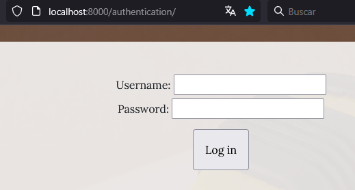
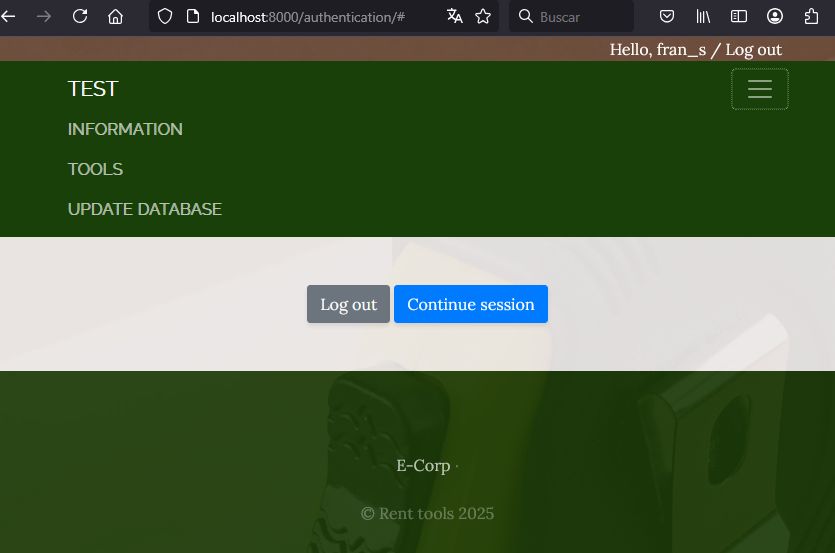
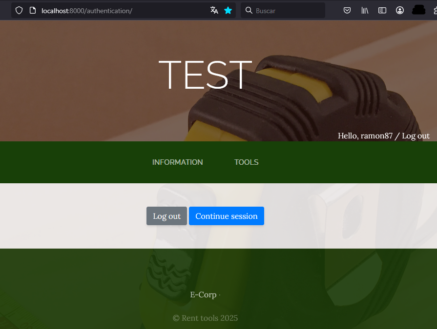
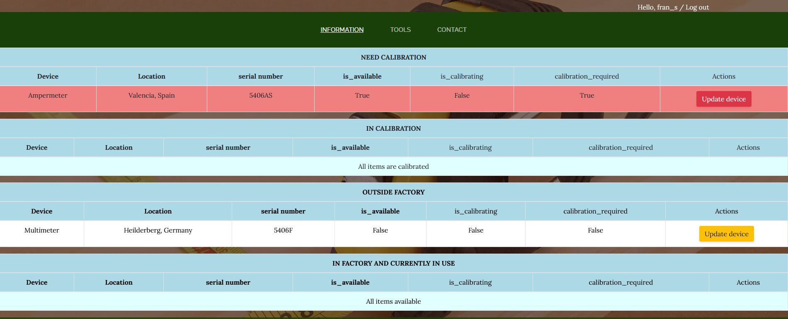
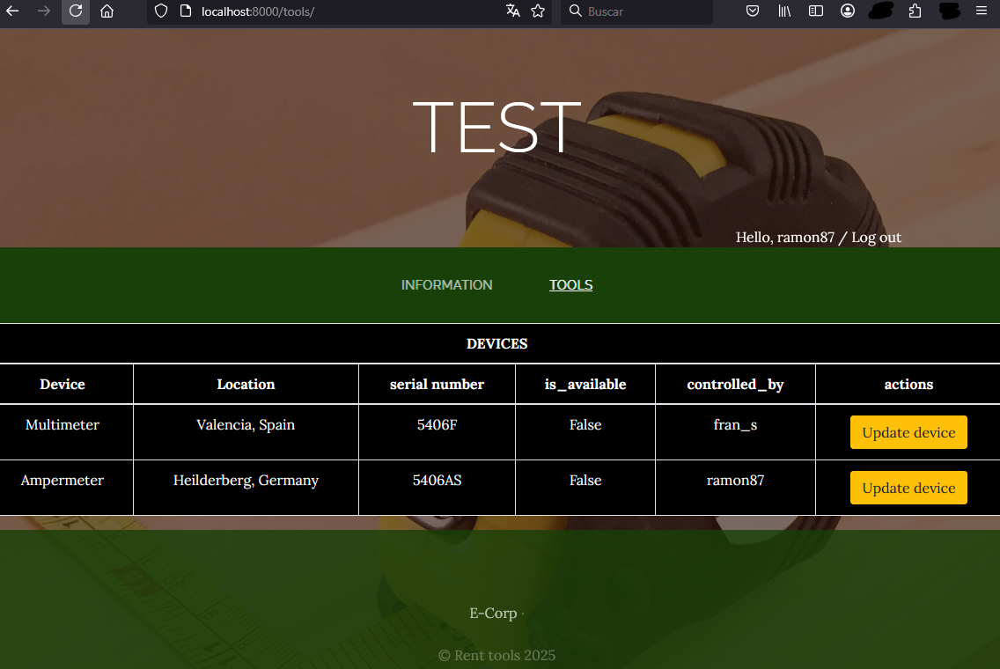
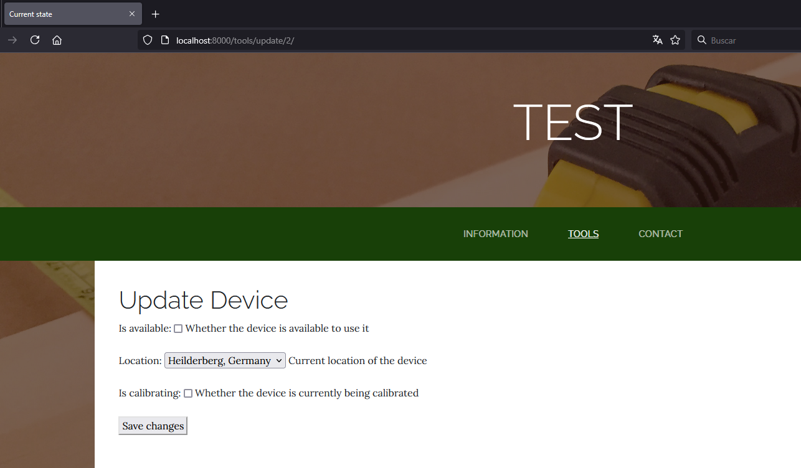

Temporal log in:

Superuser navbar & logout:

Common user navbar & logout:

Temporal page to see devices that are not available or need calibration:

Temporal page to see all devices. It will have an option to search.

Temporal small form that opens when update device button is pressed:

