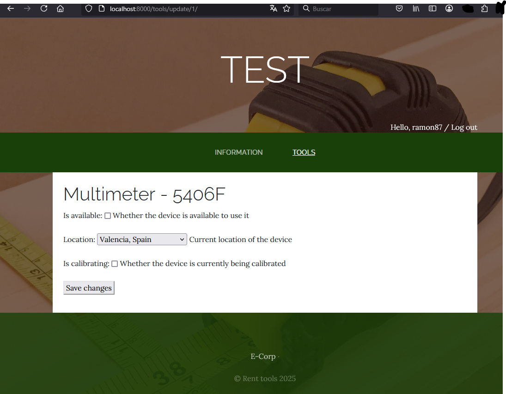

Log in address and view:

Superuser navbar & logout:

Common user navbar & logout:

Page to see devices that are not available or need calibration:

**On top there is a button to send a summary by email to all users.

Page to see all devices. PENDING: Option to filtter.

Small form for "renting users" to update device's properties:

*Controled_by field will authomaticatly update:

**IF user logged in changes location or device's avaliability to false THEN controled_by=user.authentified

**IF DEVICE'S location is (in this case Valencia, Spain) AND device's avaliability is True OR device's is_calibrating is True THEN controled_by=None
Temporal small form that opens when update device button is pressed:

